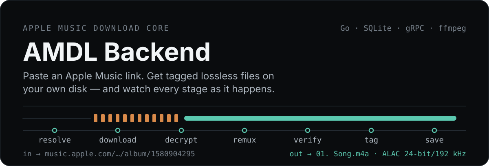
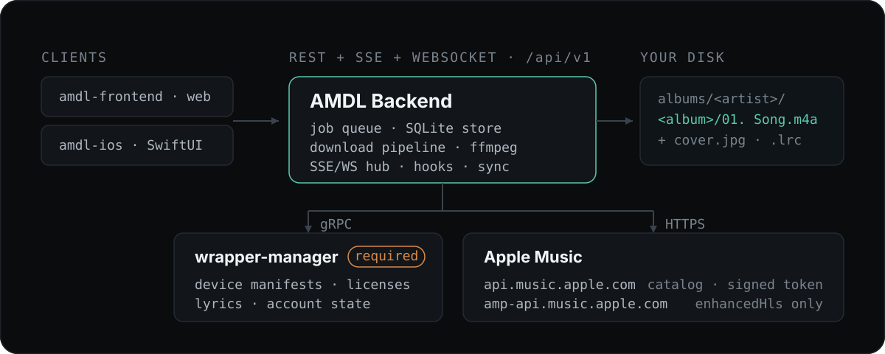
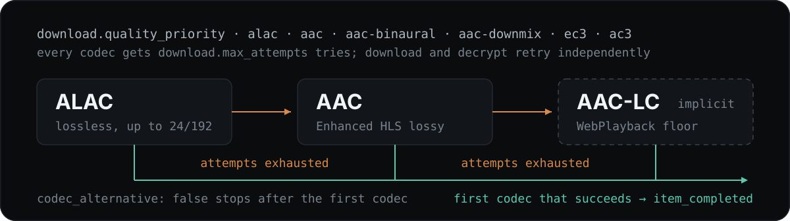

<p align="center">
  
</p>

<p align="center">
  <a href="https://github.com/AMDL-Web/apple-music-downloader-backend/actions/workflows/ci.yml"></a>
  <a href="https://github.com/AMDL-Web/apple-music-downloader-backend/releases"></a>
  <a href="https://github.com/AMDL-Web/apple-music-downloader-backend/pkgs/container/apple-music-downloader-backend"></a>
  
  <a href="LICENSE"></a>
</p>

<p align="center"><a href="README.md">English</a></p>

**丢一条 Apple Music 链接进去。它解析出曲目，取回加密的 Enhanced HLS 媒体，解密、重封装、
打标签，把成品文件写到你自己的磁盘上——每一步都实时推送出来。**

一个 Go 二进制、一个 SQLite 文件，`/api/v1` 上的 REST + SSE + WebSocket 接口，以及 AMDL
网页端与 iOS 端所依据的 OpenAPI 3.1 规范。支持单曲、专辑、歌单、艺人和电台。

---

## 快速开始

前置条件：一个可达的 [`wrapper-manager`](#架构) 实例——设备清单、许可证和歌词都从它拿，
没有它下载不了任何东西。

```bash
docker compose up -d
```

这会从 GHCR 拉取多架构镜像（无需本地构建），以内置示例为模板生成 `configs/config.yaml`，
监听 `:18080`。在 `docker-compose.yml` 里用 `AMDL_WRAPPER_ADDRESS` 指向你的 wrapper。

想从源码跑——Go 版本以 [`go.mod`](go.mod) 为准，另需 `PATH` 上的 `ffmpeg`：

```bash
go run ./cmd/amdl-api
```

提交一张专辑：

```bash
curl -X POST http://localhost:18080/api/v1/downloads \
  -H 'Content-Type: application/json' \
  -d '{"url":"https://music.apple.com/cn/album/1580904295"}'
```

盯着它跑——每首曲目的每次状态变化都是一行：

```bash
curl -N http://localhost:18080/api/v1/downloads/{job_id}/events
```

跑完之后：

```text
data/downloads/albums/<艺人>/<专辑>/01. Song.m4a   ← ALAC，封面与歌词已内嵌
                                   cover.jpg      ← 独立封面
```

交互式 API 文档：<http://localhost:18080/docs>。

## 架构

<p align="center">
  
</p>

**`wrapper-manager` 不是可选项。** 它持有 Apple Music 账号登录态，通过 gRPC 提供设备清单、
Widevine 许可证和歌词。连接是懒建立的，所以后端不等它就能启动——
`GET /api/v1/wrapper/status` 才是判断它是否真的可达的地方。

**Apple 有两个主机，而且不能互换。** `api.music.apple.com` 是有文档的官方 API，接受自签的
developer token。`amp-api.music.apple.com` 是 Apple 内部的网页播放器端点，只认从
`music.apple.com` 抓下来的 JWT，并且是 `enhancedHls` 清单和 `editorialVideo` 动态封面的
**唯一**来源。它没有文档，随时可能变，所以从它读到的东西必须退化成「这张专辑没有那个字段」，
而不是让任务失败。

**这里没有鉴权，是故意的。** 所有端点都是开放的，包括 `GET /api/v1/developer-token`。这是
下载核心，访问控制属于你放在它前面的反向代理、网关或会话层。

## 一首曲目是怎么下下来的

每首曲目都走同一条路。每次状态变化都会作为一条 `item_progress` 事件推送，`phase` 即为曲目
状态：

```text
queued → resolving → waiting_download → downloading → waiting_decrypt
       → decrypting → remuxing → saving → tagging → completed
```

除状态外，每个 item 还带一份持久化的阶段进度——`resolved`、`remuxed`、`verified`、
`tagged`、`saved`——所以中途重连的客户端不必重放事件流就能画出一模一样的进度。

媒体逐片段解密后直接送进 `ffmpeg`，任何时候都不会有整轨明文落盘。扁平化、完整性校验和打
标签全都在 `download.temp_dir` 里完成，只有成品文件才移进 `downloads_dir`。

### 编码回退

<p align="center">
  
</p>

`download.quality_priority` 是一个有序列表——`alac`、`aac`、`aac-binaural`、`aac-downmix`、
`ec3`、`ac3`。每个编码各有 `download.max_attempts` 次尝试，下载阶段与解密阶段分别计数，
重试采用带随机抖动的指数退避。AAC-LC 不需要写进去：它会作为最后的 WebPlayback 保底格式自动
追加。设 `codec_alternative: false` 则只尝试第一个编码。

### 并发

三个进程级、跨全部任务共享、启动时固定的池：`max_parallel_downloads`（16）、
`max_parallel_decrypts`（32）、`max_parallel_wrapper_requests`（24），外加
`max_running_jobs`（3）个 worker 槽位。池满时许可按提交时间分配，最早提交且未完成的任务优先，
因此任务倾向于逐个完成而非交错推进。交互式 API 请求永远不排在任务后面。

`download.memory_mode` 是内存与临时盘 I/O 的取舍：`low`（默认）把加密整轨写成可续传的检查点
再读回；`high` 改为留在内存里。详见
[docs/download-pipeline.md](docs/download-pipeline.md)，实测数据见
[docs/benchmarks.md](docs/benchmarks.md)。

## 文件保存在哪

每种任务类型一行模板，相对 `download.downloads_dir` 解析，末段是文件名并自动追加 `.m4a`。

| 配置项 | 默认值 |
| --- | --- |
| `download.song_path_format` | `songs/{ArtistName}/{AlbumName}/{TrackNumber:02d}. {SongName}` |
| `download.album_path_format` | `albums/{ArtistName}/{AlbumName}/{TrackNumber:02d}. {SongName}` |
| `download.artist_path_format` | `artists/{ArtistName}/{AlbumName}/{TrackNumber:02d}. {SongName}` |
| `download.playlist_path_format` | `playlists/{PlaylistName}/{SongNumber:02d}. {SongName}` |
| `download.station_path_format` | `stations/{StationName}/{SongNumber:02d}. {SongName}` |

`{AlbumArtist}`、`{ReleaseYear}`、`{UPC}`、`{DiscNumber}`、`{Codec}` 等变量的完整列表见
[`configs/config.example.yaml`](configs/config.example.yaml)，数字类变量支持 `:02d` 补零。
目录段中的 `{ArtistName}` 取集合的归档艺人，保证同一专辑落在同一目录；文件名段用曲目自身的
艺人。启用后还会在旁边写出独立的 `cover.jpg` / `artist.jpg` 以及 `.lrc` / `.ttml` 歌词边车
文件。

## API

`http://localhost:18080/docs` 是基于
[`internal/api/openapi.yaml`](internal/api/openapi.yaml) 的在线 Swagger UI，该文件是所有
请求与响应结构的唯一事实来源。

| | |
| --- | --- |
| **下载** | `POST /downloads` · `GET /downloads` · `GET/DELETE /downloads/{id}` · `POST /downloads/{id}/cancel` · `POST /downloads/{id}/retry` |
| **事件** | 单任务 `GET /downloads/{id}/events`（+ `/ws`） · 总览 feed `GET /downloads/events`（+ `/ws`） |
| **音质** | `POST /quality` —— 不建任务，探测一条链接当前声明的编码与音质 |
| **Wrapper** | `GET /wrapper/status` · `POST /wrapper/login` · `POST /wrapper/login/{login_id}/2fa` · `POST /wrapper/logout` |
| **配置** | `GET /config` · `PUT /config` · `GET /hooks` |
| **资料库同步** | `GET /library-sync` · `POST /library-sync/reset` |
| **系统** | `GET /health` · `GET /developer-token` · `GET /logs` · `GET /logs/stream`（+ `/ws`） |

提交接口接受 `url` 或 `urls`，以及一个只对该批任务生效的 `overrides` 对象——编码优先级、
内存模式、路径模板、歌词选项、`force_overwrite`、hooks 允许列表，以及电台和私人歌单所需的
`media_user_token`。令牌不会出现在任何响应里。

每个响应都带 `X-Request-ID`；传入你自己的同名头，之后
`GET /logs?request_id=<id>` 就能把该请求的访问日志与任务日志聚合起来。

带 curl 示例的完整说明：[docs/api.md](docs/api.md)。

## 配置

只有一个文件 `configs/config.yaml`，首次启动时以
[`configs/config.example.yaml`](configs/config.example.yaml) 为模板生成。示例文件就是文档
——每个键的取值范围、单位和默认值都写在它的注释里。

- **运行期字段**（音质、路径、歌词、封面、重试、simulate、资料库同步）通过
  `PUT /api/v1/config` 立即生效；该接口会整体重写文件并丢弃注释。
- **启动期字段**（监听地址、数据库路径、wrapper 地址、各种池大小、日志格式）需要重启。
- **任意字段**都可以用 `AMDL_<大写段名>_<大写键名>` 覆盖，例如
  `AMDL_DOWNLOAD_QUALITY_PRIORITY=alac,aac`。无法识别的 `AMDL_*` 变量会让启动失败，而不是被
  静默忽略；被环境变量固定的字段在 `PUT` 时返回 422。

细节、升级注意事项与 Docker 部分见 [docs/configuration.md](docs/configuration.md) 和
[docs/deployment.md](docs/deployment.md)。

## 自动化

**任务 hooks**（[`configs/hooks.yaml`](configs/hooks.yaml)）在任务排队或进入终态时触发
webhook 或本地命令——刷新媒体服务器、跑后处理脚本。默认关闭。

**资料库同步**轮询已登录的 Apple Music 资料库，把新加入曲目所属的**整张专辑**作为普通下载
任务提交：手机上收藏一首歌，NAS 那边自动把专辑下下来。默认关闭——这是唯一会自己创建任务的
功能。由于 Apple 并不提供资料库曲目可靠的「加入时间」，它以 `sort=-dateAdded` 的**顺序**而
非时钟落锚。

两者都在 [docs/automation.md](docs/automation.md) 里。

## 限制

- **只做音频。** Apple Music MV 不会被支持：L3 限制下只能拿到低分辨率视频，达不到本项目的
  质量目标。
- **单用户，没有账号。** 这份代码里根本不存在「用户」这个概念，也没有鉴权。请在前面放网关。
- **电台是滚动列表。** 电台解析的是 Apple 当前的「接下来播放」，一次下载捕获的是此刻给出的
  若干首，而不是固定编目。直播电台（Apple Music 1 之类）会以明确错误结束。
- **部分目录数据没有文档。** `enhancedHls` 和动态封面来自 `amp-api.music.apple.com`，随时
  可能消失。

## 文档

| | |
| --- | --- |
| [docs/api.md](docs/api.md) | 全部端点、curl 示例、任务 overrides、SSE/WS 语义 |
| [docs/configuration.md](docs/configuration.md) | 配置文件、环境变量覆盖、运行期与启动期字段、升级说明 |
| [docs/deployment.md](docs/deployment.md) | Docker、挂载、`PUID`/`PGID`、配置播种、发版与镜像 tag |
| [docs/download-pipeline.md](docs/download-pipeline.md) | 重试、编码回退、并发池、内存模式、歌词 |
| [docs/automation.md](docs/automation.md) | 任务 hooks 与资料库同步 |
| [docs/benchmarks.md](docs/benchmarks.md) | 后解密与端到端实测数据 |

> `docs/` 正文为英文，与 `config.example.yaml` 的字段注释保持一致。

## 开发

```bash
go test ./...
```

加 `-count=1` 可绕过 Go 测试缓存。CI 在每次推送 `main` 和每个 PR 上执行 `gofmt`、`go vet`、
完整测试、race detector 和 `govulncheck`。

`ffmpeg` 是流水线唯一需要的外部命令；样本抽取、重封装、元数据与封面写入都由进程内的
`mp4ff` / `go-mp4tag` 完成。

日常改动落在 `dev`；`main` 只用于发版且要求 PR。每个提交都需要 DCO 签名
（`git commit -s`），见 [CONTRIBUTING.md](CONTRIBUTING.md)。发版方式为合并标题带版本号的
`dev` → `main` PR，或手动运行 `Release` workflow；两者都会创建 GitHub Release 并推送多架构
镜像到 GHCR。

## 许可证

[AGPL-3.0](LICENSE)。
