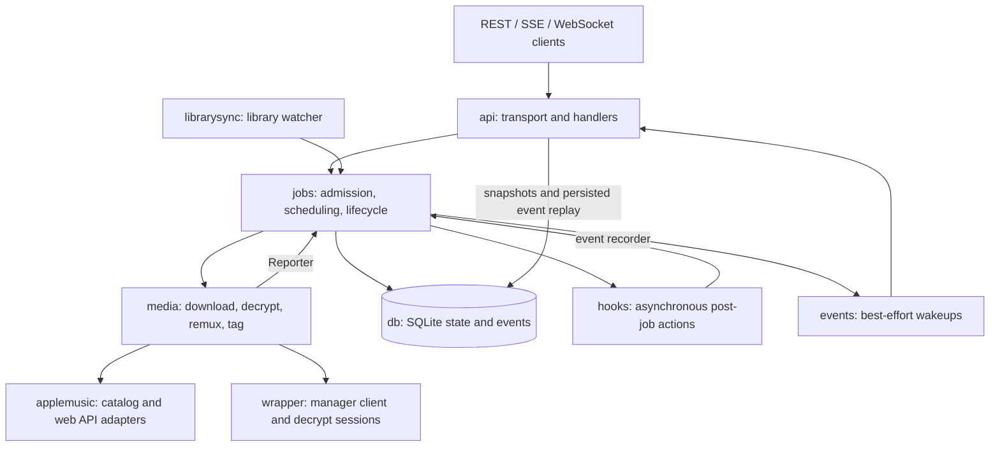

# Backend architecture

The backend remains one Go service with a SQLite store and in-process workers.
`cmd/amdl-api` constructs the shared dependencies and coordinates shutdown.



## Ownership

- `jobs.Manager` owns submission deduplication, worker admission, recovery,
  cancellation, retry and finalization. Deletion goes through the manager so
  terminal rows cannot be deleted while finalization or hooks are in flight.
- `media.Downloader` implements the job processor and reports changes through
  `jobs.Reporter`. Its per-job config copies share process-wide resource limits;
  download/decrypt concurrency is not multiplied by the number of jobs.
- `db.Store` owns SQL and durable events. Terminal status and its event commit
  together. The in-memory hub accelerates delivery; it is not an event store.
- `config.Store` supplies runtime snapshots to the API, workers and watcher.
  Configuration persistence and mutable-field rules stay in `config`.
- Deployment-level access control remains outside this service. Public Apple
  API and internal web-player authentication remain separate in `applemusic`.

## API organization

| File in `internal/api` | Responsibility |
| --- | --- |
| `server.go` | Dependency wiring, routes, health and CORS |
| `catalog_handlers.go` | Quality, wrapper session and developer-token endpoints |
| `config_handlers.go` | Runtime config and hook listing |
| `downloads.go` | Submission, filtering, snapshots, cancellation, retry and deletion |
| `job_events.go` | Single-job SSE/WS validation, framing and connection setup |
| `event_replay.go` | Shared single-job cursor, paging and terminal-drain lifecycle |
| `downloads_feed.go` | Overview SSE/WS, milestone coalescing and snapshots |
| `http_json.go` | JSON body limits, decoding and error responses |

Library-sync and observability handlers keep their existing dedicated files.
These files remain in one package; splitting responsibilities adds no new
service, transport hop or dependency container.

## Reliable event replay

Single-job SSE and WebSocket share one replay loop, with transport-specific
write, flush and keepalive operations. It reads at most 512 events per page.
The cursor advances after successful writes; an SSE page is flushed together.
Hub notifications trigger reads, and a ten-second tick recovers dropped wakes.

A failed database read preserves the cursor and retries on the next wake/tick.
It cannot be treated as a drained backlog, even when the job is terminal. The
loop checks manager finalization before pending hooks, then successfully drains
once more before closing: a hook may commit its final event during that check.
Write or flush errors stop delivery. HTTP observation propagates flush errors
instead of hiding them from the stream handler.

Preflight behavior is unchanged: a terminal job with unseen events replays its
backlog; a terminal job with no remaining events returns HTTP 409. SSE resumes
with `Last-Event-ID`, WebSocket with `last_event_id`.

## Progress reads

An overview upsert needs the job and two live counters, not every item's
metadata. `db.CountItemProgress` aggregates completed/skipped and failed items
using the existing job-item index, returning two integers. SQL still scans the
job's items; the optimization removes per-item transfer, decoding and Go heap
allocation. No schema or index migration is required.

The detail endpoint still loads items and derives counters from that same
slice. This keeps the counters consistent with the items included in its
response. List-query counters retain their existing SQL aggregation.

Reproduce the counter comparison with:

```sh
go test ./internal/db -run '^$' -bench '^BenchmarkItemProgress$' -benchmem -count=3
```

On an Apple M4 Pro, Go 1.26.5, darwin/arm64, an in-memory SQLite fixture with
1,000 completed items produced these medians across three runs:

| Counter read | Time/op | Allocated bytes/op | Allocations/op |
| --- | ---: | ---: | ---: |
| Load items, then count | 2.297 ms | 2,502,079 | 16,092 |
| SQL aggregation | 0.218 ms | 856 | 21 |

This is a counter-read microbenchmark (about 10.5 times faster), not a production
endpoint or download-throughput measurement. Fixture setup is excluded.

## Compatibility and scope

This refactor preserves routes, response shapes, configuration keys, database
schema and output paths. Existing snapshot, resume, pagination and hook tests
cover the transport contracts. Additional replay tests inject database and
client failures; counter tests compare SQL results with domain counting.

The media pipeline and manager lifecycle remain separate existing boundaries.
They were reviewed for ownership and resource sharing; their scheduling and
media processing behavior are not changed by this API-focused optimization.
